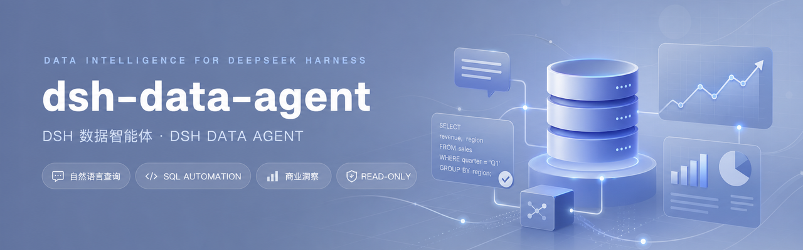
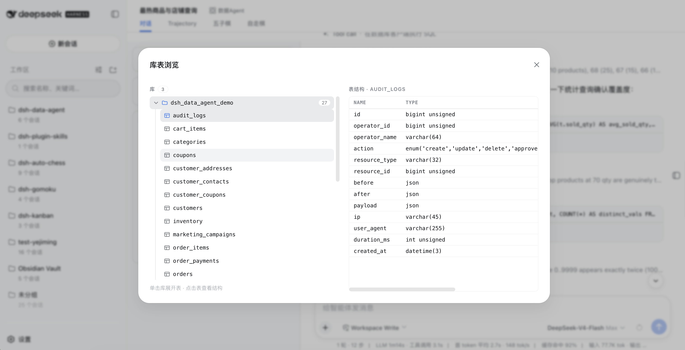
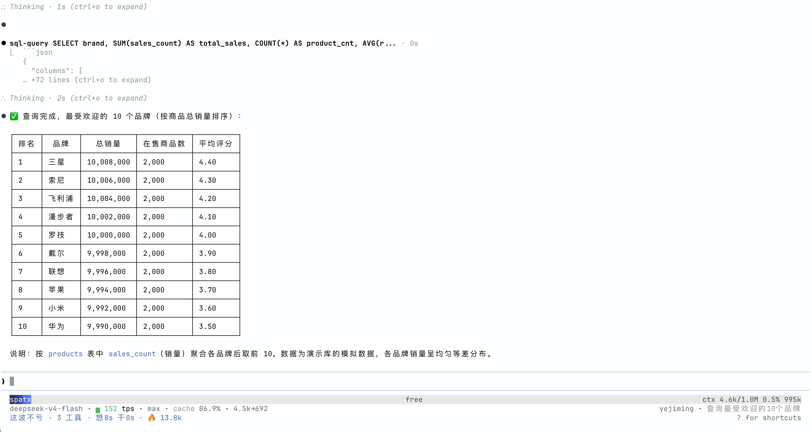

# DSH Data Agent · Analyze Data Through Conversation

[中文](README.md) | **English**

<p align="center">
  
</p>
<p align="center">
  
  &nbsp;
  
  &nbsp;
  
  &nbsp;
  
</p>
<p align="center">
  <strong>Connect DeepSeek Harness to databases and turn conversations into data analysis and business insights</strong><br>
  <em>Natural-language queries · Automatic SQL execution · Iterative analysis · Web UI · dsh-tui · Read-only protection</em>
</p>

<p align="center">

[Project Overview](#project-overview) · [Features](#features) · [Quick Install](#quick-install) · [Web UI](#using-data-agent-in-the-web-ui) · [dsh-tui](#using-data-agent-in-dsh-tui) · [Security](#security)

</p>

## Project Overview

dsh-data-agent is a data analysis plugin for DeepSeek Harness (DSH). Connect a database and ask a business question; DSH inspects schemas, writes and runs SQL, continues the analysis from real results, and returns clear conclusions and business insights. The plugin supports both the Web UI and dsh-tui without modifying the DSH source code.

## Features

- **Analyze data through conversation**: Describe your goal in natural language. DSH understands the question, breaks it into analysis steps, queries real data, and organizes the conclusions. You can keep asking follow-up questions to explore the same context in greater depth.
- **Discover business insights automatically**: Data Agent goes beyond returning query results. It helps compare trends, locate anomalies, identify valuable customers or products, and turn the data into explanations that support decisions.
- **Web analysis reports (render-analysis)**: In the Web UI the agent can choose, within an ordinary tool call, to produce a single chart or a Dashboard-style report (metric/line/bar/pie/scatter/table views) with an inline preview and a “View analysis” Modal. Whether to chart is the agent's decision — schema exploration, single scalars, and queries without visual value are never forced into charts.
- **Works with both Web UI and dsh-tui**: For a visual workflow, we recommend [zhu1090093659/dsh-web-ui](https://github.com/zhu1090093659/dsh-web-ui), where you can connect databases, browse schemas, and inspect results in the browser. For a keyboard-first workflow, we recommend [ccch1mneyyy/dsh-TUI](https://github.com/ccch1mneyyy/dsh-TUI), where you can use the same Data Mode, connect through `/database`, and move directly into conversational analysis. Both interfaces provide the core Data Agent experience.
- **Connect common business databases**: Supports MySQL, PostgreSQL, SQLite, Oracle, Hive, and Impala across application databases, analytics systems, local data files, and data warehouses.
- **Let DSH complete the analysis loop**: DSH inspects table structures, writes SQL, runs the query, and adjusts its approach based on errors or returned data instead of stopping at an unverified SQL draft.
- **Stay focused with Data Mode**: The session uses DSH's native `str_replace_editor` for files and keeps `sql-query`, `sql-write`, and `sql-cmd`; Web additionally provides `render-analysis`. Host or community tools such as `describe_image` and `ssh_*` do not leak into Data Mode.
- **Work safely with real data**: Use read-only mode and a read-only database account when appropriate. TUI passwords are masked and are never restored as part of a form draft. You decide whether the session may modify data.


The Web UI also includes an embedded database workbench for browsing schemas, inspecting columns, and running an occasional SQL statement. Once the conversation starts, the workbench moves to the sidebar so it does not interrupt the analysis.



Choose “Data Mode” when creating a session, and DSH will use the data-analysis workflow for everything that follows.


## Quick Install

The Web UI and dsh-tui use separate DSH profiles. Install only the profile for the interface you use, or run both commands if you use both interfaces.

### Method 1: npm (recommended)

```sh
dsh plugin --profile web add @yejiming/dsh-data-agent
dsh plugin --profile dsh-tui add @yejiming/dsh-data-agent
```

### Method 2: GitHub

```sh
dsh plugin --profile web add github:omdsh-dev/dsh-data-agent
dsh plugin --profile dsh-tui add github:omdsh-dev/dsh-data-agent
```

The plugin installs the Data Mode preset automatically. No local build is required.

## Using Data Agent in the Web UI

Start the Web UI:

```sh
dsh --profile web
```

Then:

1. Create a session and choose “Data Mode.”
2. Enter your connection details in the database workbench.
3. Once connected, ask an analysis question directly in the conversation.
4. Follow up on the first result and ask DSH to narrow the scope, compare dimensions, or summarize the conclusions.

For example, ask: “Analyze order changes over the last 30 days, identify the regions and products with the largest revenue decline, and explain the main causes.” DSH will inspect the relevant tables, generate and run the queries, and complete the analysis from real results.

### Web analysis reports

In the Web UI, Data Mode also provides the render-analysis tool: the agent first explores and verifies facts with sql-query, then decides for itself whether a visualization helps. When it does, one tool call produces one versioned analysis report:

- A report holds 1-6 read-only datasets and 1-8 views (metric, line, bar, pie, scatter, table); multiple views may reuse one dataset, and aggregation or Top N is written in the SQL itself;
- Simple questions produce a single main chart (inline preview in the result row); complex questions produce a compact summary plus a “View analysis” button;
- “View analysis” opens a large Modal with every view of that report: a compact metric band, a full-width main chart, a two-column secondary grid, and a detail table — responsive across light/dark themes and narrow screens;
- The complete report snapshot is persisted with the session log: refreshing or replaying history never re-queries the database and creates no extra browser storage;
- The tool is Web-only: the dsh-tui tool surface is unchanged and loads no chart or browser dependencies.

## Using Data Agent in dsh-tui

Start the terminal interface:

```sh
dsh --profile dsh-tui
```

In a blank session, switch to Data Mode and connect a database:

```text
/preset data-agent
/database connect
```

The connection form displays all relevant fields together. Use Tab or Shift+Tab to move between fields. Press Enter on database type or read-only mode to show every option, use the arrow keys to select one, and press Enter again to confirm.

After connecting, return to the chat input and ask a business question. Other useful database commands include:

```text
/database status       Show the current connection
/database test         Test the current connection
/database disconnect   Disconnect the current database
```

When you reopen the connection form in the same session, it restores the latest database type, host, port, user, database, and read-only mode. The password always remains masked and is never restored.



## How to Ask Better Analysis Questions

For more valuable results, include the business goal, time range, and dimensions you care about. For example:

```text
Analyze revenue and gross-margin changes by region in Q2 2026.
Find the regions with unusual performance, drill down into categories and key customers,
and recommend three concrete business actions.
```

You can also ask DSH to save the SQL or analysis so it can be reviewed and reused:

```text
Complete a member repeat-purchase analysis, save the final SQL to
analysis/repurchase.sql, and summarize the main findings in a format suitable for a weekly report.
```

## Before You Start

DSH must be able to reach the target database from your machine, and the corresponding database client must be installed:

- SQLite is usually included with macOS or Linux.
- MySQL requires the `mysql` client.
- PostgreSQL requires the `psql` client.
- Oracle, Hive, and Impala require their respective command-line clients.

We recommend creating a read-only database account so Data Agent can explore and analyze data without modifying production records.

If you see `failed to mount` or a missing `@yejiming/dsh-data-agent` package error, the plugin is usually not installed in the current profile. Make sure you ran the matching install command for the Web UI or dsh-tui, then restart DSH.

## Security

- Prefer a read-only database account and enable read-only mode in the connection form.
- Temporary passwords entered in the Web UI or dsh-tui are used only for the current connection. The TUI displays only `*` and never restores the password when the form is reopened.
- If authentication must be restored across processes, use a DSH credential reference instead of putting a plaintext password in command arguments.
- When read-only mode is disabled, Data Agent can run update or administrative statements at your request. Before connecting to a production database, review the account permissions and backup policy.
- Database connections are isolated by session, making it easier to keep different projects, customers, and analysis environments separate.

## Uninstall and Rollback

```sh
dsh plugin --profile web remove @yejiming/dsh-data-agent
dsh plugin --profile dsh-tui remove @yejiming/dsh-data-agent
rm -rf $DSH_HOME/.agent-presets/data-agent
```

Uninstalling the plugin does not automatically delete saved non-secret connection information. If you need to remove it completely, back it up first and then delete the corresponding Data Agent storage records in DSH.

## Local Development

```sh
pnpm install
pnpm build
pnpm test
```

The prebuilt `lib/` directory is committed to the repository, so npm and GitHub installations do not require a local build.

## License

MIT

## Related Links

- [dshfind.com](https://dshfind.com): A Chinese learning and sharing community for DeepSeek Harness
- [dsh-web-ui](https://github.com/dsh-external/dsh-web-ui): A collection of plugins and skins for the DeepSeek Harness Web UI
- [dsh-cc-tui](https://github.com/dsh-external/dsh-cc-tui): A Claude Code-style full-screen terminal interface
