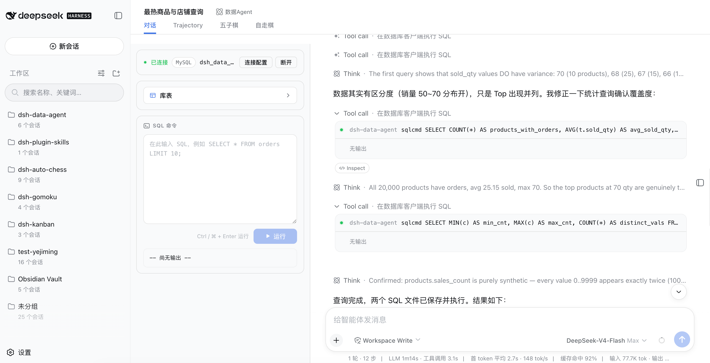
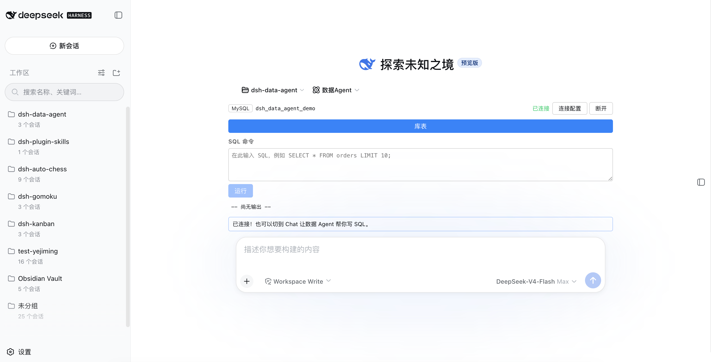
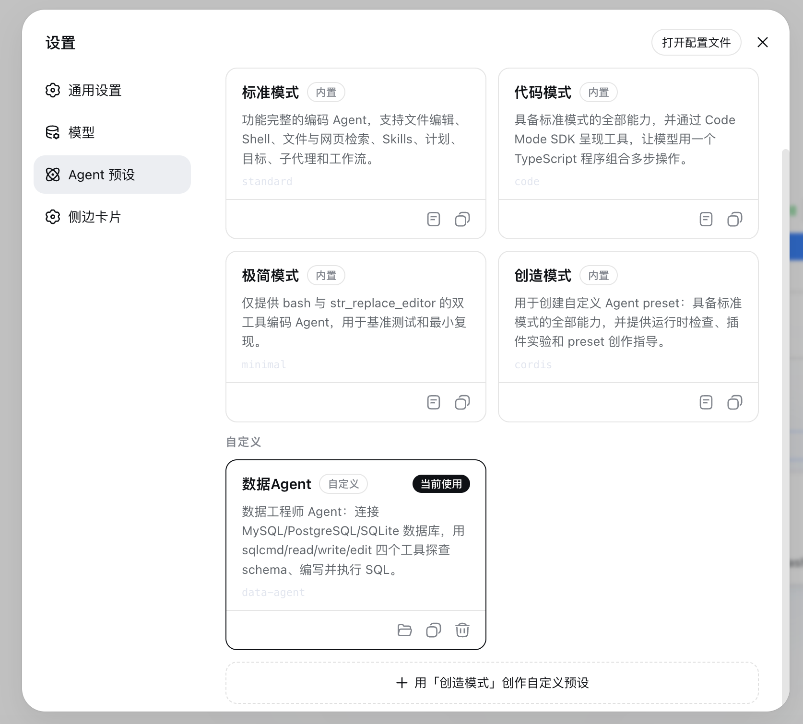

# Data Agent · Let AI Connect Your Database and Write SQL

[中文](README.md) | **English**



This plugin is a Data Agent built on DeepSeek Harness, letting DeepSeek focus on database operations.

Leveraging the agent-preset capability of DeepSeek Harness, it adds a Data Agent preset. The preset keeps only the three DSH built-in tools — read, edit, write — and adds custom sql-query / sql-write / sqlcmd database tools in place of the bash tool, free from irrelevant tools and prompts.

With this preset, you can configure a database connection right in the conversation UI, grant the AI access to the database, and complete CRUD operations.

## Features

- **Database connection management**: per-session connections to MySQL / PostgreSQL / SQLite / Oracle / Hive / Impala (SQLite uses a file path, Oracle a service name/SID, Hive/Impala a default database). Connection state lives in server memory and survives layout switches; passwords stay in memory and travel to the client via environment variables or stdin connect prefixes — never written to disk on the server.

  

- **Database workbench** (embedded above the session's input bar): connection config card (collapses into a summary row after connecting, expandable for review); schema explorer (a "Tables" button opens a Modal — single-click a database to expand its scrollable table list, click a table to inspect its columns); SQL command box (write and run SQL on the non-agent channel, monospace output). The connection config is persisted to browser localStorage — switching pages or restarting restores the form and auto-reconnects. Once the conversation starts, the workbench becomes the left column and the chat records + input bar sit on the right.
- **Database tools**: `sql-query` runs read-only SQL and returns structured `{ columns, rows, affectedRows, elapsedMs }`; `sql-write` runs one write/management SQL per call with explicit autocommit semantics; `sqlcmd` keeps the original raw terminal output. All three run through the database clients (mysql / psql / sqlite3 / sqlplus / beeline / impala-shell); no shell layer (argv arrays + SQL via stdin), timeouts terminate the process tree, output is bounded and truncated, and one call carries at most one SQL statement.
- **Data Agent preset**: choose "Data Agent" when creating a session — the tool surface is `sql-query`/`sql-write`/`sqlcmd`/`read`/`write`/`edit`, and every other project tool (bash, grep, skill, todo, goal, web, subagent, …) is simply absent, i.e. disabled; non-Data-Agent sessions render no workbench at all.

  

- **Standard agent loop**: a data-agent session is an ordinary DSH session — standard turn/step, streaming, tool scheduling, and persistence, with zero host changes.

## Quick Install

Two install methods, neither requires a local build (the prebuilt output in
`lib/` is committed, and no `prepare`/`prepack` scripts are declared).

### Method 1: npm (recommended)

```sh
# Install from npm (initializes the profile on first use)
dsh plugin --profile web add @yejiming/dsh-data-agent
```

### Method 2: GitHub source

```sh
# Install from the GitHub source (lib/ is committed, no build at install time)
dsh plugin --profile web add github:omdsh-dev/dsh-data-agent
```

Verify the install:

```sh
dsh --profile web --dump-config   # the data-agent layer should appear
ls $DSH_HOME/.agent-presets/data-agent/   # agent.cordis.yml + preset.yml (auto-installed)
```

Start the Web GUI:

```sh
dsh --profile web
```

In the Web GUI: create a session → choose the "Data Agent" preset → the database workbench appears above the input bar → fill in the connection info (type/host/port/user/password/database; SQLite uses a file path) → after connecting, browse schemas (single-click a database to expand tables, click a table for its structure) or run SQL directly in the command box → once the conversation starts the workbench moves to the left; in Chat ask the AI to "list all tables and count rows" or "write a SQL query for orders in the last 30 days, save it to orders.sql and run it".

> Database client binaries: sqlite3 usually ships with macOS/Linux; mysql / psql / sqlplus / beeline / impala-shell must be provided by the deployment and can be overridden per type via the `clients` config (missing clients are named in the connect error).

## Architecture

```text
Browser (apps/web)                        Host process (dsh --profile web)
┌─────────────────────────────┐          ┌──────────────────────────────────────┐
│ Database workbench (input.dock) │ fetch │ @yejiming/dsh-data-agent (host row)│
│  · connection config (6 types) │ ─────▶ │  · /plugins/data-agent/* routes       │
│  · schema explorer + SQL box   │        │  · dataAgentConnections store         │
│  · hero stacked / active rail  │        │  · preset self-install → $DSH_HOME/   │
└─────────────────────────────┘          └──────────────┬───────────────────────┘
                                                       │ same process
        data-agent session (full agent loop reuse)     ▼
┌──────────────────────────────────────────────────────────────────────────┐
│ agent.cordis.yml (preset layer, only 3 rows)                             │
│  · persona             → data-engineer system prompt                     │
│  · dsh-tool-fs         → read / write / edit (project built-ins)         │
│  · dsh-data-agent/tool → sql-query / sql-write / sqlcmd (tool half)      │
└──────────────────────────────────────────────────────────────────────────┘
```

One npm package, three loadable faces, two host rows:

| Face | Entry | Loaded by |
|---|---|---|
| Server half (connection store / preset self-install) | `lib/index.js` (host row `data-agent`) | Host composition: provides `dataAgentConnections`, seeds connections, self-installs the preset; works headless too |
| Server half (HTTP routes) | `lib/routes.js` (host row `data-agent-routes`, exports subpath `./routes`) | Host composition: registers routes via a nested inject only where a webserver exists (skipped automatically headless) |
| Tool half | `lib/tool.js` (exports subpath `./tool`) | Only mounted by the data-agent preset (`tool-sqlcmd` row) |
| Browser half | `lib/client.js` (`dsh.client` declaration) | Browser: the database workbench in the input dock (`conversation.input.dock`) |

The tool half only consumes host services (`tools`, `subprocess`, `dataAgentConnections`) and provides none, so the preset guard needs no `isolate` realm.

## Configuration

Every field has a loader default; there are no library-level defaults. Host row `data-agent`:

| Key | Meaning |
|---|---|
| `presetId` | Preset directory name installed under `$DSH_HOME/.agent-presets/` (default `data-agent`) |
| `installPreset` | Whether to self-install the preset on startup (default true; existing directories are skipped, keeping user edits) |
| `connectTimeoutMs` | End-to-end deadline for one /connect connectivity check (default 10000 ms) |
| `introspectMaxTables` | Cap on the table list returned by /connect and /status (default 500) |
| `queryTimeoutMs` | Deadline for one database-tool query (default 30000 ms) |
| `maxResultChars` | In-memory cap on captured database-tool output, per stream (default 20000 chars) |
| `clients` | Per-type CLI client overrides: `{ command?, args? }` for keys `mysql` / `postgres` / `sqlite` / `oracle` / `hive` / `impala` (built-in defaults mysql/psql/sqlite3/sqlplus/beeline/impala-shell) |
| `connections` | Config-seeded connections keyed by session id (`'*'` = wildcard default for any session without its own; headless/keyless runs and deployments pinning one database). **No password field** — passwords only enter memory via the /connect route |

The `tool-sqlcmd` row (inside the data-agent preset) additionally has `maxRows` (default 100, enforced: an unbounded SELECT gets a top-level LIMIT and structured parsing truncates as a second guard); `queryTimeoutMs` / `maxResultChars` / `clients` share the host row's names and defaults.

The `data-agent-routes` row has its own config: `connectTimeoutMs` / `introspectMaxTables` / `maxResultChars` mirror the main row; plus `queryTimeoutMs` (for /query and metadata queries, default 30000) and `maxQueryChars` (single-SQL length cap for /query, default 65536).

```yaml
# Example override in cordis.patch.yml or a profile layer
- id: data-agent
  name: '@yejiming/dsh-data-agent'
  config:
    clients:
      mysql:
        command: /usr/local/bin/mysql-client
    # Wildcard default connection: sessions without an explicit /connect fall back
    # to this database (password-free scenario only)
    connections:
      '*':
        type: sqlite
        database: /tmp/analytics.db
```

## Headless / One-shot Runs

**Important**: `dsh run` (the headless bundle) does not mount the agent-presets roster and never mounts presets for sessions — preset mounting belongs to the web surface (the api-proxy mounts on session creation). Therefore **headless sessions cannot use the sql-query/sql-write/sqlcmd/read/write/edit tool surface**; the database tools are verified and used on the web surface. Headless database work is limited to the host base's own tools (e.g. calling clients via bash).

(Note: inserting the roster row plus disabling the base tool rows cannot reproduce the preset tool surface headless — the agent ends up with an empty, zero-tool composition. For a headless smoke test, verify "seeded connections + host tools work" only.)

The `data-agent-routes` row is skipped automatically in profiles without a webserver (nested inject), so nothing needs special handling.

## HTTP API

Prefix `/plugins/data-agent` (same-origin calls from the browser half):

| Method/Path | Meaning |
|---|---|
| `POST /connect` | body `{ sessionId, type, host?, port?, user?, database, password? }`; validate → connectivity check (list tables) → save only on success, returns `{ ok, tables }`, failure returns `{ ok: false, error }` without saving |
| `POST /disconnect` | body `{ sessionId }`; drop the session's connection |
| `GET /status?sessionId=` | `{ connected, summary? }`; summary is the password-stripped connection plus the table list |
| `GET /schemas?sessionId=` | `{ ok, schemas: string[] }`; database list (sqlite returns `['main']`) |
| `GET /tables?sessionId=&schema=` | `{ ok, tables: string[] }`; tables of one schema (sqlite ignores the schema param) |
| `GET /describe?sessionId=&schema=&table=` | `{ ok, columns: [{ name, type, nullable? }] }`; table structure (sqlite ignores schema) |
| `POST /query` | body `{ sessionId, sql }`; runs one SQL statement (the workbench command box, non-agent channel), returns `{ ok, result: { exitCode, stdout, stderr, truncated } }`; `sql` length capped by `maxQueryChars`; multiple statements are rejected; readonly rejects writes |

Schema/table identifiers allow only `[A-Za-z0-9_$]` (server-side whitelist and per-type quoting; injection-shaped input is rejected).

## Security Notes

- **Passwords**: server-side, memory only; transport per type — mysql via `MYSQL_PWD`, postgres via `PGPASSWORD` environment variables; oracle via the sqlplus `connect user/pass@...` stdin prefix, hive via the beeline `!connect` stdin prefix (never argv); impala sends no password by default (LDAP/kerberos configured through `clients`). `/status` and the public connection-store reads strip passwords.
- **Connection-config persistence**: the workbench saves the connection config (type/host/port/user/database) to browser localStorage (key `dsh-data-agent.connection.v1`) to restore the form and auto-reconnect once on page switches/restarts. **Passwords are not persisted by default**; they are stored only when "remember password" is explicitly checked (plain-text localStorage, opt-in). To clear: run `localStorage.removeItem('dsh-data-agent.connection.v1')` in the browser console.
- **No shell layer**: `ctx.subprocess.spawn` uses argv arrays, SQL and connect prefixes travel via stdin — no shell concatenation injection surface; metadata route identifiers pass the whitelist.
- **SQL execution authority**: with the approval policy set to `never`, `sql-write`/`sqlcmd` and `/query` execute DDL/DML directly — connections are session-isolated; assess the data-plane risk yourself. `readonly: true` rejects write statements; each database-tool call is an independent client process with autocommit, so transactions do not span calls.
- **Timeouts & caps**: query timeouts, output truncation, table-list caps, and the /query SQL length are all config items — no hard-coded tunables.

## Uninstall & Rollback

```sh
dsh plugin --profile web remove @yejiming/dsh-data-agent   # removes the dependency and its layer
rm -rf $DSH_HOME/.agent-presets/data-agent                      # manually delete the self-installed preset
```

Connections are in-memory; there is no persisted data to clean up.

## Development

Build and test:

```sh
pnpm build   # cleans and rebuilds lib/ (tsdown: lib/index.js, lib/routes.js, lib/tool.js, lib/invariant.js, lib/client.js) + tsc declarations
pnpm test    # vitest: connection store / CLI templates / sqlcmd execution (mocked subprocess)
```

`lib/` is committed, so installing and debugging (including `dsh plugin add .`)
never requires a build. To rebuild the artifacts, just run `pnpm install`: all
`@deepseek-ai/*` dependencies are published on npm, so there is no need to copy
or symlink `node_modules` from a local DSH checkout anymore.
`pnpm-workspace.yaml` follows the dsh convention (`nodeLinker: hoisted`); pnpm
11's supply-chain policy blocks freshly published packages and dependency build
scripts, so the repository pre-declares `minimumReleaseAgeExclude` (the rc.6
family) and `allowBuilds: esbuild`.

## License

MIT

## Friends

- [dshfind.com](https://dshfind.com): Chinese learning & sharing community for DeepSeek Harness — read the papers, write plugins, see the whole ecosystem.
- [dsh-web-ui](https://github.com/dsh-external/dsh-web-ui): Plugins & skins collection for the DeepSeek Harness (DSH) Web UI
- [dsh-cc-tui](https://github.com/dsh-external/dsh-cc-tui): Claude Code style fullscreen interactive terminal plugin
